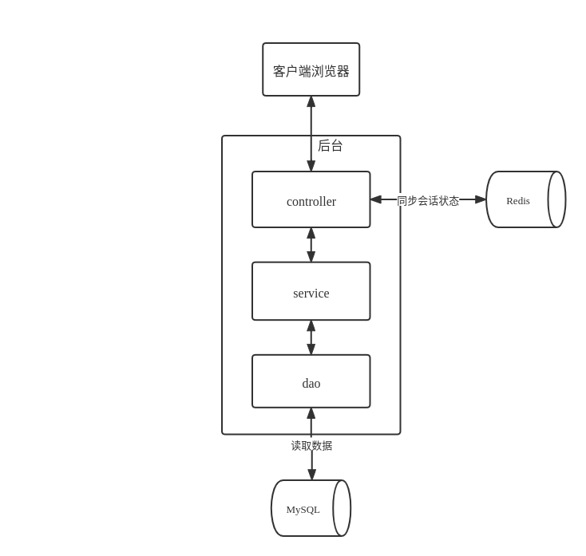

# 基于SpringBoot的写作分析系统

[Gitee地址](https://gitee.com/lerry-lee/writer-demo)

[Github地址](https://github.com/lerry-lee/writer-demo)

本项目的原型是[基于SSM的写作分析系统](https://gitee.com/lerry-lee/simple-writer)，对其进行技术栈升级。

# 功能介绍

- 写作分析：对英文段落进行智能分析，该功能调用了UTS的API
- 存档评分功能： 保存写作内容并添加标题和评分
- 报表功能：记录历史写作内容，展示历次评分情况
- 社区功能：分享帖子到社区，可以评论和被评论，查看评论消息
- 关于：API介绍，用户建议收集
- 座右铭：一个CSS动画  

# 技术选型

| 技术 | 说明 |
| ---- | ---- |
| MySQL | 数据库 |
| Redis | 缓存 |
| Java | 编程语言 |
| SpringBoot | Java应用框架 |
| MyBatis | ORM框架 |
| Layui | 前端UI框架 |

# 系统架构



系统加构图如上图所示，单体架构，基于SpringBoot开发，遵循MVC模式，前后端分离项目。

下面以登陆请求为例，介绍系统运行逻辑：

1. 客户端请求到后台，controller层拦截请求； 
   
2. 检查当前用户名和密码是否正确(查数据库)，如果错误返回失败响应给前端，否则步骤3;
   
3. 生成一个随机字符串作为token和用户身份绑定(token->用户模型)，将该key-value对保存到Redis中(设置过期时间为30分钟)；

4. 返回给前端token，前端保存token信息，用来访问其他页面前验证用户是否登陆
   (目前逻辑是在导航栏的js加载时带上token去验证用户是否登陆有效)；

# 启动步骤

1. 先决条件
配置Java环境，安装MySQL、Redis；

```shell
#启动MySQL后，创建数据库
CREATE DATABASE IF NOT EXISTS writer1 DEFAULT CHARSET utf8 COLLATE utf8_general_ci;
#导入项目根目录下`sql/writer1.sql`，source命令后面注意文件路径
use writer1;
source writer1.sql;
```

2. 修改配置文件`src/main/resources/application.yml`，配置MySQL、Redis连接参数

3. 启动后台程序

运行jar包`target/writerdemo.jar`

```shell
java -jar writerdemo.jar;
```

或运行启动类`src/main/java/com/example/writerdemo/WriterDemoApplication.java`

4. 访问前端页面进行测试

登陆页`ui/login.html`，使用已注册用户名和密码`admin/admin`或重新注册新用户

# Tips

- 写作分析API调用的UTS的API，可能已经不可用；

- 报表页面的饼状图和折线图有bug，还未修复；
